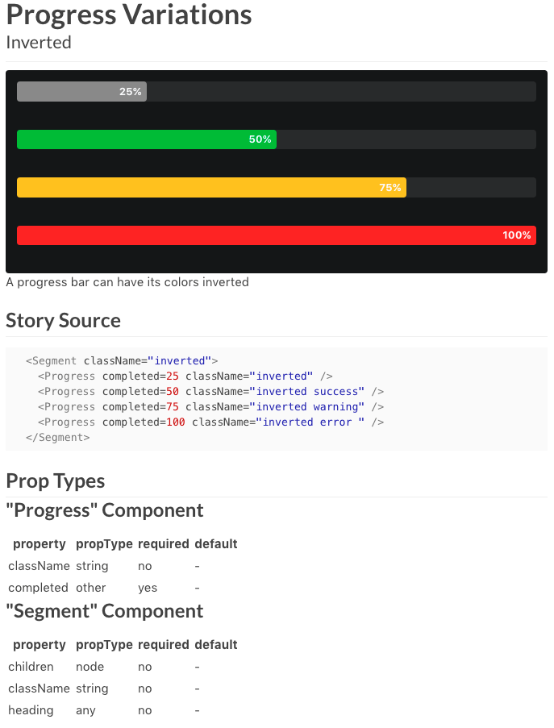

# Semantic-UI-React-Storybook
## Isolate Semantic-UI React Component Development with Hot Reloading

A Kadira Storybook for Semantic-UI React components

[View this storybook on GitHub Pages](https://white-rabbit-japan.github.io/Semantic-UI-React-Storybook)

To run locally:

`npm install`
`npm run storybook`

Open web browser to `http://localhost:9001`
